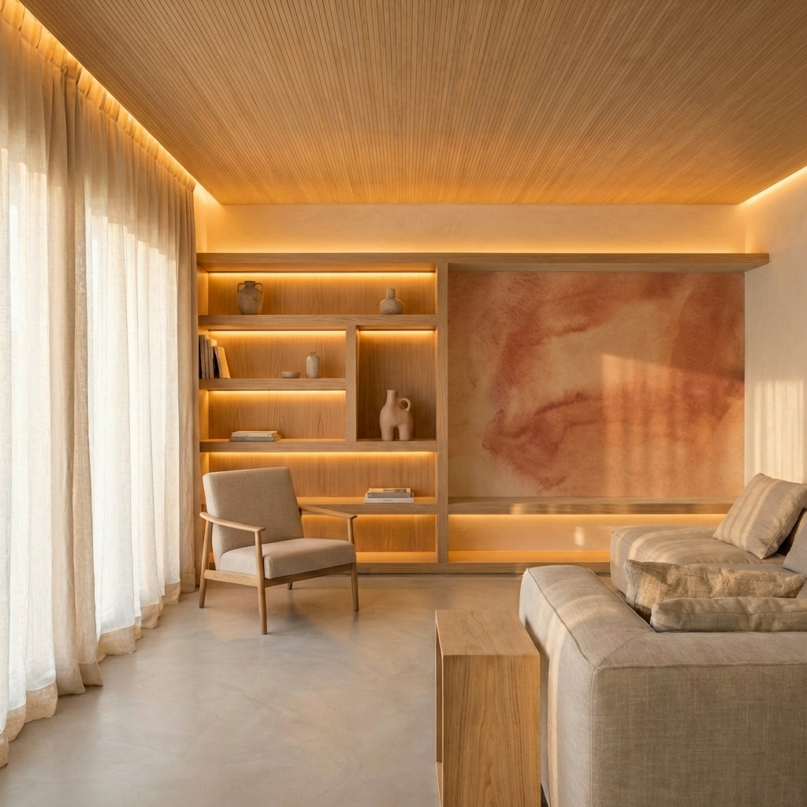
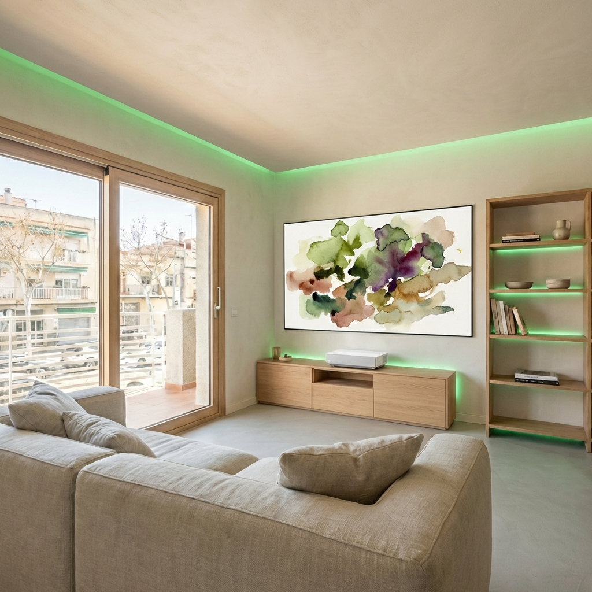
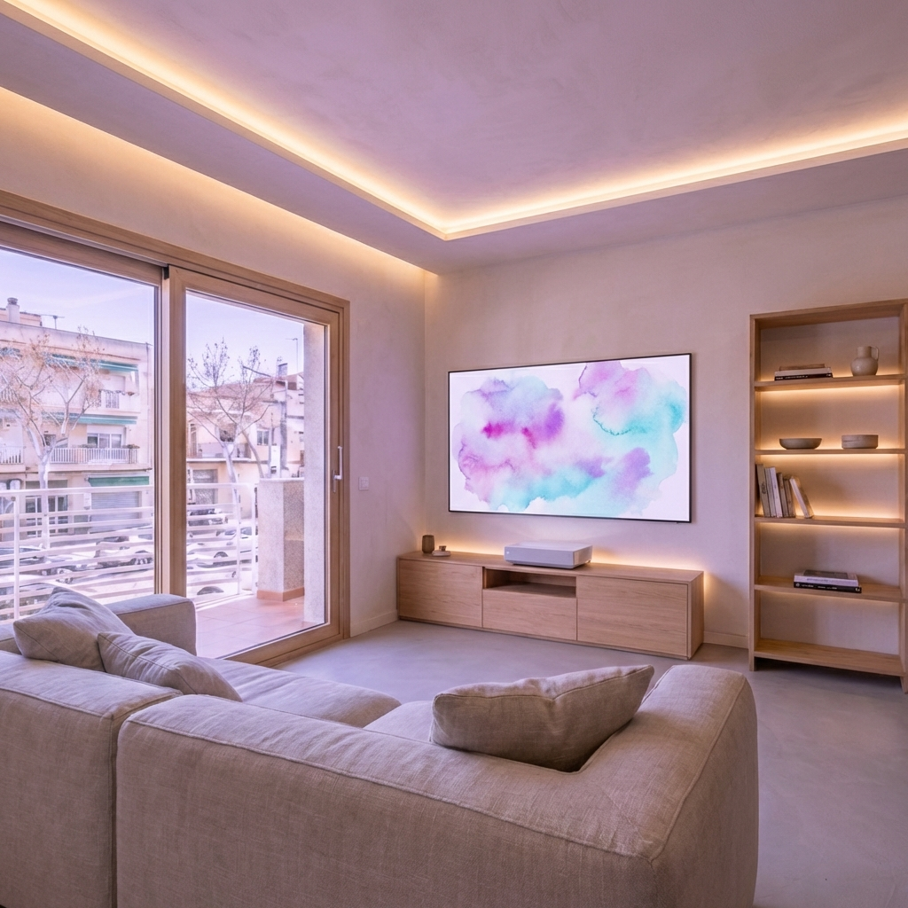

# Estudi avançat d'interiorisme i atmosfera | Casa RSM

Aquest document recull la investigació i les propostes de disseny per a l'interior de la Casa RSM, integrant l'ADN històric de l'edifici, la visió artística de la propietat i les possibilitats tecnològiques de la domòtica DIY.

---

## 1. L'ADN de la Casa RSM: Anàlisi d'inspiració

A partir de la documentació tècnica, les fotografies de 1986 i l'obra artística personal, hem definit tres pilars fonamentals:

### ADN tècnic (EnerPHit i Minimalisme)
*   **Base Neutra:** Ús de l'estuc de calç blanc trencat i microciment gris seda.
*   **Puresa Visual:** Ocultació de sistemes tècnics i integració de solucions d'accessibilitat invisible.
*   **Materials Nobles:** Fusta de roure natural, ferro negre i ceràmica artesana.

### ADN històric (Memòria de 1986)
*   **Reinterpretació del Terratzo:** Paviments amb un gra subtil que evoca l'original sense perdre el minimalisme.
*   **Volums d'Obra:** Ús de prestatgeries i mobiliari integrat arquitectònicament en les parets.
*   **Ritme Vertical:** Inspiració en les baranes originals per a nous elements metàl·lics.

### ADN artístic (Color i Llum)
*   **Paleta Cinètica:** Colors extrets de les aquarel·les: *Groc Ocre vibrant*, *Roig Terracotta polsós* i *Blau Mediterrani aquarel·lat*.
*   **Llum Difusa:** La importància de les ombres orgàniques i la llum filtrada (cortines de lli).

---

## 2. El Concepte "Sala Viva": Tecnologia i Art

La proposta central per a la sala d'estar és la creació d'un espai camaleònic que canvia segons l'estat d'ànim o l'hora del dia.

### Mural de Projecció Digital
*   Ús de la paret d'estuc de calç com a pantalla per a projeccions d'art abstracte (pintures pròpies).
*   Integració amb **Home Assistant** per automatitzar el contingut segons escenes.

### Il·luminació Programable (HA DIY)
*   Tires LED ocultes que permeten "pintar" les parets amb els tons de la paleta artística, evitant la pintura estàtica.

---

## 3. Escenes d'Atmosfera

S'han definit tres configuracions base per al sistema domòtic:

### Escena 1: Matinada Daurada
*Energia i llum matinal extreta de les aquarel·les grogues.*

### Escena 2: Capvespre Blau
*Calma i meditació mitjançant blaus i cians.*

### Escena 3: Arrel Terra
*Calidesa orgànica i textures de terracotta.*

### Escena 4: Vinya Penedès
*Revitalitzant i fresc, inspirat en els paisatges de vinyes del Penedès.*

### Escena 5: Somni de Lavanda
*Atmosfera creativa i màgica amb tons magentes i blaus cian.*

---

## 4. Referències de Mobiliari i Complements

Selecció basada en la "Taula de botigues virtuals" i el concepte de mobiliari lleuger:

*   **Butaca i Descans:** Stressless Office en cuir marró per a l'estudi i butaques de roure i lli (Kenay Home / Tikamoon).
*   **Mobiliari d'Obra:** Prestatgeries integrades de calç i roure, i calaixeres minimalistes de fusta clara.
*   **Tèxtils:** Lli rentat en tons *Blau Mediterrani* i *Sorra* per al dormitori.

---

## 5. Espais Especialitzats

### Dormitori: El Refugi Climàtic
*   **Distribució:** Llit perpendicular a la paret de la dreta, maximitzant l'espai central i la fluïdesa cap al balcó.
*   **Personalització:** Obra abstracta de gran format sobre el capçal, banyada per la llum de la fussa LED del sostre.
*   **Connexió Exterior:** Obertura total cap al balcó mitjançant grans correderes de roure, eliminant barreres visuals.

### Estudi PB: Hub Professional i Creatiu
*   **Zones de Treball:** Triple estació (Digital, Artística, Electrònica) alineada a la paret esquerra.
*   **Ergonomia:** Integració de la cadira Stressless per a llargues jornades de concentració.
*   **Llum Natural:** Connexió visual directa amb el pati bioclimàtic al fons de l'estança.

---

## 6. Tecnologia Audiovisual: Laser TV

Per mantenir l'estètica de "Cozy Minimalism" i l'absència de pantalles negres domines, s'opta per un sistema de **Laser TV** a la sala d'estar.

### Característiques del Sistema:
*   **Projector UST (Ultra Short Throw):** Ubicat sobre el moble de roure a pocs centímetres de la paret. Substitueix completament la TV tradicional.
*   **Funcionalitat Smart TV:** Integració nativa d'aplicacions (Netflix, YouTube, Movistar+, etc.) mitjançant sistemes operatius com Tizen o Android TV.
*   **Pantalla ALR (Ambient Light Rejection):** Perforació òptica que bloqueja la llum del balcó i reflecteix només la del projector, permetent la visió clara durant el dia.
*   **Integració Home Assistant:** Control total de l'encesa, les fonts de vídeo i la sincronització amb les "Escenes d'Atmosfera".

### Avantatges RSM:
1.  **Invisible:** Quan no s'utilitza, la sala recupera la seva puresa arquitectònica.
2.  **Immersiu:** Fins a 120 polzades de projecció d'art o cinema sense ocupar espai físic.
3.  **Versàtil:** Permet alternar entre el "Mural Digital" d'art abstracte i el consum de continguts multimèdia estàndard.

### 6.2. Integració Domòtica DIY (Home Assistant)

Per a la Casa RSM, la integració del sistema Laser TV no és només funcional, sinó part de l'experiència atmosfèrica:

*   **Control de Potència i Fonts:** Integració mitjançant `Samsung SmartTV Console` o `Android TV Remote` (segons el model). Permet l'encesa automàtica vinculada a escenes.
*   **Control per IR (DIY Bridge):** Ús d'un mòdul **ESP32 amb ESPHome** per a control per infrarojos en cas d'equips sense API oberta, garantint la privacitat local.
*   **Protocol HDMI-CEC:** Sincronització total amb reproductors externs (Apple TV, Nvidia Shield) per reduir la fragmentació de comandaments.
*   **Automatització "Escena Cinema":**
    1.  Tancament de proteccions solars exteriors.
    2.  Transició de la il·luminació a l'Escena "Capvespre Blau" (intensitat 10%).
    3.  Encesa de la font de vídeo i el projector Laser TV amb l'app (HBO Max / Filmin) preseleccionada.

---

## 7. Arquitectura Home Assistant DIY: El Cervell Invisible

La Casa RSM es gestiona mitjançant un sistema centralitzat de codi obert que prioritza la privacitat i el funcionament local.

### Dashboard Personalitzat "Casa RSM 2026":
*   **Interfície Minimalista:** Disseny basat en el concepte de la sala, amb botons tàctils per a les 5 Atmosferes principals.
*   **Mural Dinàmic:** Control del contingut d'art abstracte projectat, sincronitzat amb el calendari solar de Vilanova (la llum canvia segons l'estació).

### Human-Centric Lighting (HCL):
*   **Ritme Circadià:** La temperatura de color (CCT) dels LEDs de la cuina i el bany s'ajusta automàticament des de 2700K (nit) fins a 5000K (migdia) per millorar el benestar.
*   **Il·luminació Indirecta:** Prioritat absoluta a les tires LED ocultes davant dels focus directes al sostre.

### Gestió Climàtica EnerPHit:
*   **Monitorització de Qualitat d'Aire:** Sensors de CO₂ i Humitat integrats via Zigbee que avisen si cal activar la ventilació mecànica forçada o obrir el pati bioclimàtic.
*   **Protecció Solar Automàtica (Oest):** Les mallorquines es tanquen proactivament a la tarda quan el sensor de radiació detecta sobreescalfament, protegint la inèrcia tèrmica del microciment.

---

*Document generat per Antigravity per al projecte de reforma Casa RSM - Gener 2026*
