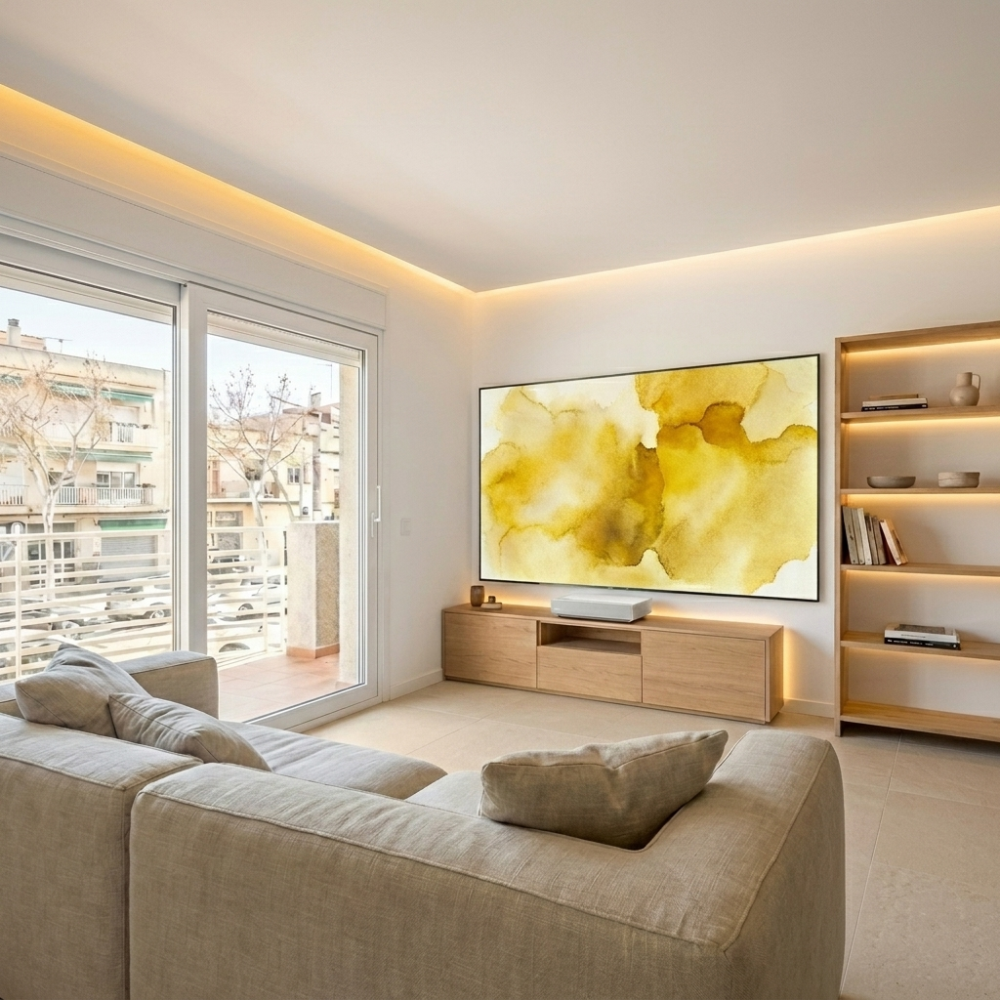
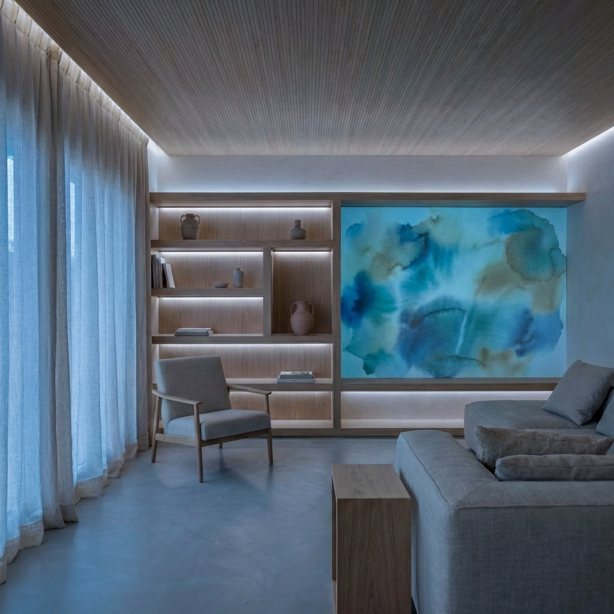
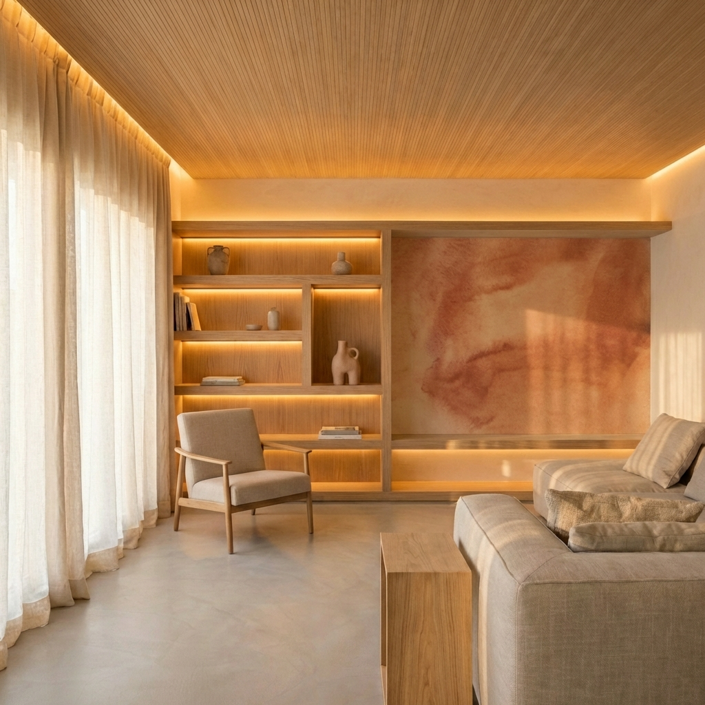
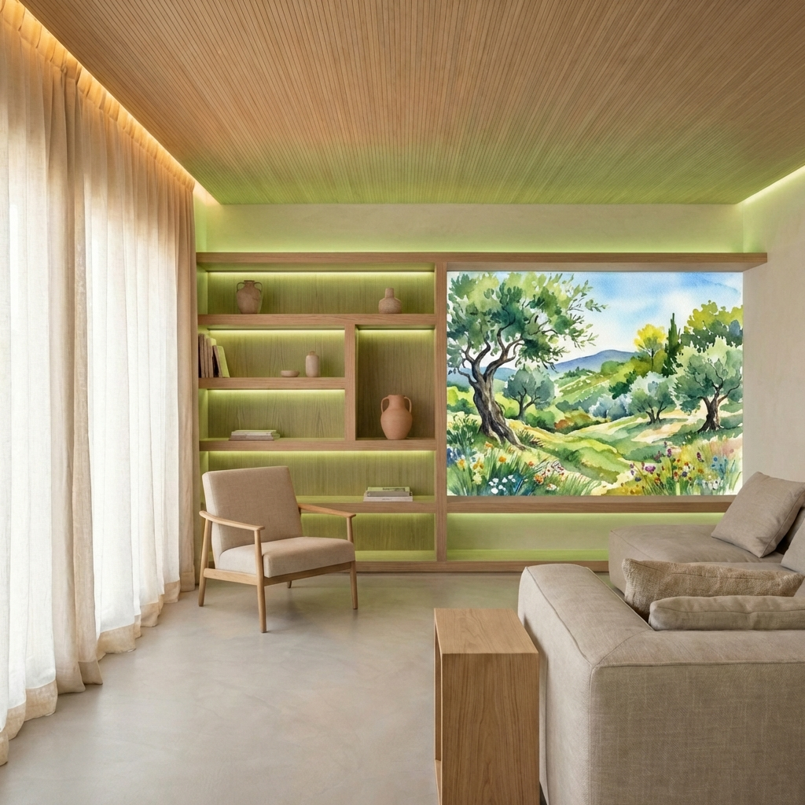
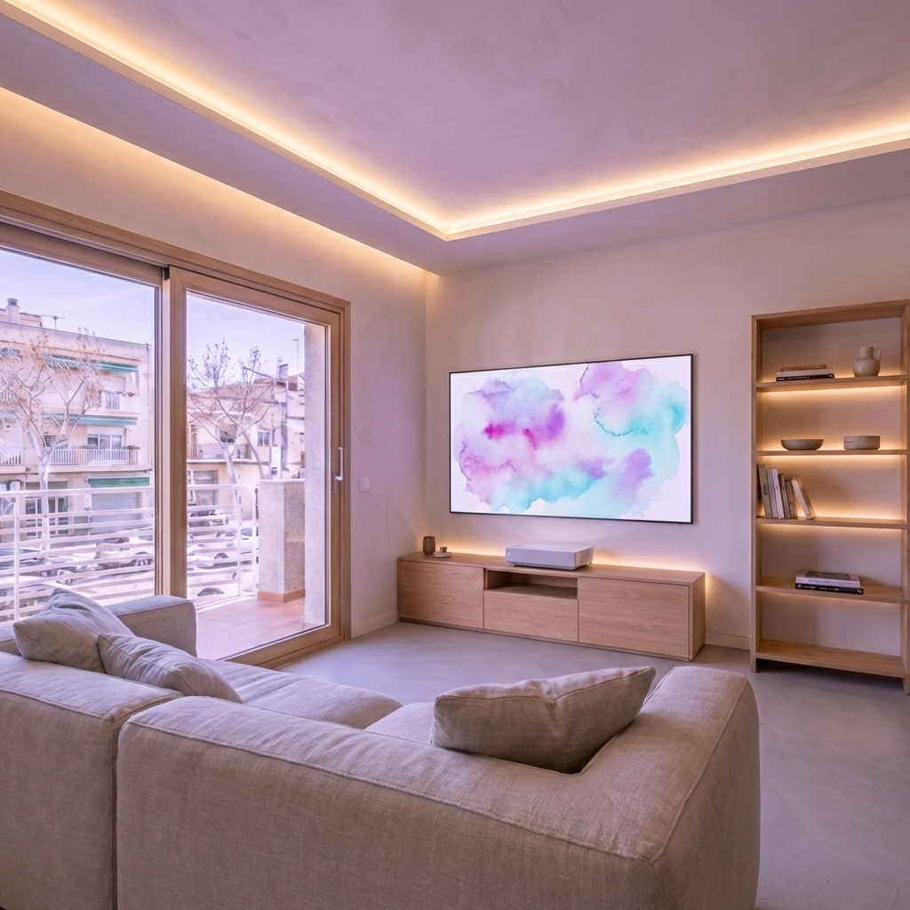

# Estudi Avançat d'Interiorisme i Atmosfera | Casa RSM

Aquest document recull la investigació i les propostes de disseny per a l'interior de la Casa RSM, integrant l'ADN històric de l'edifici, la visió artística de la propietat i les possibilitats tecnològiques de la domòtica DIY.

---

## 1. L'ADN de la Casa RSM: Anàlisi d'Inspiració

A partir de la documentació tècnica, les fotografies de 1986 i l'obra artística personal, hem definit tres pilars fonamentals:

### ADN Tècnic (EnerPHit i Minimalisme)
*   **Base Neutra:** Ús de l'estuc de calç blanc trencat i microciment gris seda.
*   **Puresa Visual:** Ocultació de sistemes tècnics i integració de solucions d'accessibilitat invisible.
*   **Materials Nobles:** Fusta de roure natural, ferro negre i ceràmica artesana.

### ADN Històric (Memòria de 1986)
*   **Reinterpretació del Terratzo:** Paviments amb un gra subtil que evoca l'original sense perdre el minimalisme.
*   **Volums d'Obra:** Ús de prestatgeries i mobiliari integrat arquitectònicament en les parets.
*   **Ritme Vertical:** Inspiració en les baranes originals per a nous elements metàl·lics.

### ADN Artístic (Color i Llum)
*   **Paleta Cinètica:** Colors extrets de les aquarel·les: *Groc Ocre vibrant*, *Roig Terracotta polsós* i *Blau Mediterrani aquarel·lat*.
*   **Llum Difusa:** La importància de les ombres orgàniques i la llum filtrada (cortines de lli).

---

## 2. El Concepte "Sala Viva": Tecnologia i Art

La proposta central per a la sala d'estar és la creació d'un espai camaleònic que canvia segons l'estat d'ànim o l'hora del dia.

### Mural de Projecció Digital
*   Ús de la paret d'estuc de calç com a pantalla per a projeccions d'art abstracte (pintures pròpies).
*   Integració amb **Home Assistant** per automatitzar el contingut segons escenes.

### Il·luminació Programable (HA DIY)
*   Tires LED ocultes que permeten "pintar" les parets amb els tons de la paleta artística, evitant la pintura estàtica.

---

## 3. Escenes d'Atmosfera

S'han definit tres configuracions base per al sistema domòtic:

### Escena 1: Matinada Daurada
*Energia i llum matinal extreta de les aquarel·les grogues.*

### Escena 2: Capvespre Blau
*Calma i meditació mitjançant blaus i cians.*

### Escena 3: Arrel Terra
*Calidesa orgànica i textures de terracotta.*

### Escena 4: Bosc Mediterrani
*Revitalitzant i fresc, basat en els teus paisatges d'oliveres i turons.*

### Escena 5: Somni de Lavanda
*Atmosfera creativa i màgica amb tons magentes i blaus cian.*

---

## 4. Referències de Mobiliari i Complements

Selecció basada en la "Taula de botigues virtuals" i el concepte de mobiliari lleuger:

*   **Butaca i Descans:** Stressless Office en cuir marró per a l'estudi i butaques de roure i lli (Kenay Home / Tikamoon).
*   **Mobiliari d'Obra:** Prestatgeries integrades de calç i roure, i calaixeres minimalistes de fusta clara.
*   **Tèxtils:** Lli rentat en tons *Blau Mediterrani* i *Sorra* per al dormitori.

---

## 5. Espais Especialitzats

### Dormitori: El Refugi Climàtic
*   **Distribució:** Llit perpendicular a la paret de la dreta, maximitzant l'espai central i la fluïdesa cap al balcó.
*   **Personalització:** Obra abstracta de gran format sobre el capçal, banyada per la llum de la fussa LED del sostre.
*   **Connexió Exterior:** Obertura total cap al balcó mitjançant grans correderes de roure, eliminant barreres visuals.

### Estudi PB: Hub Professional i Creatiu
*   **Zones de Treball:** Triple estació (Digital, Artística, Electrònica) alineada a la paret esquerra.
*   **Ergonomia:** Integració de la cadira Stressless per a llargues jornades de concentració.
*   **Llum Natural:** Connexió visual directa amb el pati bioclimàtic al fons de l'estança.

---

*Document generat per Antigravity per al projecte de reforma Casa RSM - Gener 2026*
