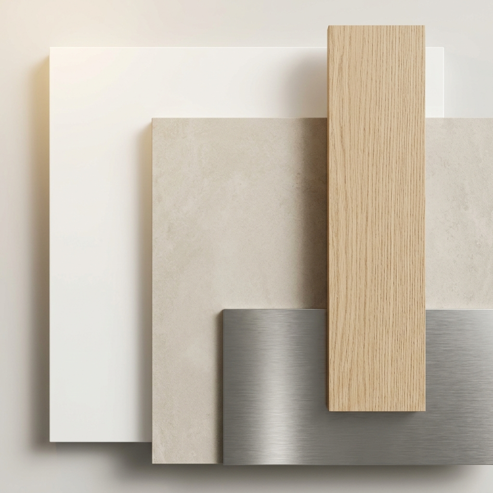

# Paleta de colors i materials - Casa RSM 2026 (PE definitiu)

Aquest document defineix l'estàndard visual per al Projecte Executiu, evolucionant el concepte original "White, Wood & Grey" cap a una proposta més càlida, duradora i arquitectònica: **"White, Oak & Sand"**.

---

## 1. Superfícies i envolupant (el llenç)

| Element | Especificació | Referència | Observacions |
| :--- | :--- | :--- | :--- |
| **Parets i sostres** | Blanc pur arquitectònic | **RAL 9016 (Mat)** | Acabat Q4. LRV ~85%. |
| **Fusteria interior** | PVC blanc / Lacat | **RAL 9016 (Mat)** | Coincideix amb el to de la paret (integració). |
| **Paviment interior** | Gres porcelànic XL | **NCS S 1502-Y50R** | To greige/sorra. LRV 55-65%. |
| **Paviment terrasses** | Continuïtat "In-Out" | **NCS S 1502-Y50R** | Mateix to, acabat antilliscant C3. |
| **Paviment PSC** | Parquet laminat | **Roure clar** | Només a la zona de refugi (sotacoberta). |

---

## 2. Elements d'accent (la calidesa)

| Element | Material / Acabat | Característiques |
| :--- | :--- | :--- |
| **Mobiliari i Escala** | **Roure Clar (RSM Standard)** | Roure Natural de gra suau (linear grain). Acabat "Fusta Crua" extra-mat (sense groguejar). |
| **Punts Focal** | **Acer Raspallat / Gris Mate** | Manetes de portes, aixetes i detalls de lluminàries. |
| **Il·luminació** | **Lux Light 3000K** | Llum càlida però tècnica (CRI > 90). |

---

## 3. Banys: especificació tècnica de colors

Per al bany de la P2 (Principal), s'aplica el nou criteri de "Bany en blanc i fusta":

1.  **Paviment**: Ceràmica càlida (continuïtat amb el paviment general).
2.  **Parets**: Blanc Pur (continuïtat amb l'habitació).
3.  **Mobiliari**: Moble suspès de **Roure Clar**.
4.  **Aixeteria**: **Encastada**. Acabat **Acer Raspallat / Gris Mate** per a un look integrat i serè.
5.  **Vidre**: Translúcid / Mat (privacitat sense perdre llum).

---

## 4. Evolució de la paleta: "White, Wood & Grey" → "White, Oak & Sand"

| Concepte     | Estat Anterior (PB) | Nou Criteri (PE 2026)          | Racional                                               |
| :----------- | :------------------ | :----------------------------- | :----------------------------------------------------- |
| **Paviment** | Parquet (SPC)       | **Ceràmica (Sorra)**           | Major durabilitat i millor inèrcia tèrmica.            |
| **Fusta**    | Tons variats        | **Roure Clar Únic**            | Evita el conflicte visual entre diferents fustes.      |
| **Blanc**    | RAL 9010 (Crema)    | **RAL 9016 (Pur)**             | Potencia el minimalisme i les línies arquitectòniques. |
| **Metalls**  | Cromat              | **Acer Raspallat / Gris Mate** | Aspecte més serè, industrial-chic i atemporal.         |

---

## 5. Envolupant exterior (façana)

L'estratègia cromàtica exterior busca la integració amb l'entorn urbà i el contrast amb la fusteria blanca interior:

| Element | Especificació | Referència | Observacions |
| :--- | :--- | :--- | :--- |
| **Cos principal** | Gris lluminós | **RAL 7035** | Acabat mat/setinat. |
| **Sòcol (PB)** | Gris finestra | **RAL 7040** | Suavitza la transició amb el paviment del carrer. |
| **Fusteria P1 i P2** | Blanc pur | **RAL 9016** | PVC blanc mat. |
| **Fusteria PB (Variant 1)** | Gris negre | **RAL 7021** | Contrast clàssic per a la base de l'edifici. |
| **Fusteria PB (Variant 2)** | Blanc pur | **RAL 9016** | Unificació total amb les plantes superiors. |

---

## 6. Especificacions tècniques de fusteria

Es defineixen criteris estructurals per a les simulacions i la comanda de materials:

1.  **Balconera P1 (cuina-menjador)**: Disseny de dues fulles (dos cossos) de vidre transparent. Perfileria mínima en PVC blanc.
2.  **Finestra bany 2 (P2 esquerra)**: Panell fix d'un sol cos. Vidre translúcid climat. Sense perfileria vertical interior per a una netedat visual màxima.
3.  **Terrasses**: El paviment de gres sorra (**NCS S 1502-Y50R**) ha de mantenir la cota i el to de l'interior, utilitzant peces amb tractament antilliscant C3.

---

## 7. Directrius per a les simulacions PE

*   Aplicar el **RAL 9016** a totes les parets de nova execució.
*   Utilitzar el **Roure RSM** per a qualsevol element de fusta (armaris, escala, detalls).
*   Garantir que el **Gres Sorra** aparegui a totes les superfícies de terra de les plantes principals per garantir la unitat cromàtica del projecte.

---
*Document actualitzat el 16 de maig de 2026 per a la coordinació del Projecte Executiu.*
