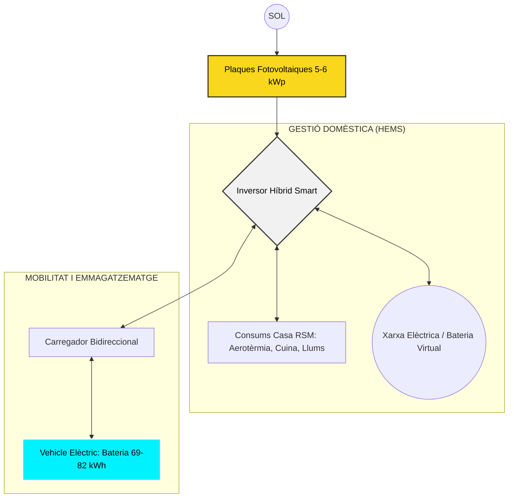

# Guia de preparació per a la segona reunió del Projecte Executiu (PE)

**Projecte:** Casa RSM | **Data de la reunió:** 9 d'abril de 2026 | **Promotor:** J. Olive

Aquest document serveix com a eina de control i registre durant la reunió amb l'arquitecte (SGArq). L'objectiu és validar que el disseny executiu manté la lògica Passivhaus, la visió estètica "L'Ànima de la Casa" i la viabilitat de subvencions.

---

## 1. Eixos estratègics

Abans d'entrar en el detall de materials, recorda aquests tres pilars que l'arquitecte ha de respectar en el nou disseny:

1. **Visió Passivhaus (EnerPHit):** Qualsevol canvi en gruixos o materials ha de garantir la Qualificació Energètica A per assegurar les subvencions NextGen i l'ICIO.
2. **L'Ànima de la Casa:** La transició mineral (1986-2026) s'ha de veure reflectida en el PE. No volem solucions "estàndard" de catàleg si trenquen el diàleg temporal del projecte.
3. **Domòtica local i privada:** La infraestructura elèctrica ha d'estar preparada per a un control 100% local (fil neutre a tot arreu, caixes de fons 60mm).
4. **Manteniment i usabilitat (O&M):** Materials, equipaments, complements i mobles han de ser de gestió i manteniment fàcils, duradors, de neteja senzilla, resistents i amb alta usabilitat.

---

## 2. Taula de validació i decisions tècniques

Aquesta taula recull els ítems que l'arquitecte sol plantejar. Utilitza la columna "La meva resposta" per guiar el diàleg i la columna "Notes de la reunió" per anotar els acords o els canvis proposats.

| Ítem / Àmbit                  | La meva resposta i criteris                                                                                            | Valors / Notes de la reunió (Per omplir) |
| :------------------------------ | :--------------------------------------------------------------------------------------------------------------------- | :---------------------------------------- |
| **Criteris generals**     | Materials, equipaments, complements i mobles de baix manteniment, alta durabilitat, neteja fàcil i resistència.      |                                           |
| **Paviments PB**          | Ceràmic (Gris o tonalitats minerals). Alta durabilitat i inèrcia.                                                    |                                           |
| **Paviments P1 i P2**     | SPC sintètic (imitant fusta natural clara). Resistent i de gruix mínim.                                              |                                           |
| **Tancaments interiors**  | Envans secs (Pladur) amb aïllament de qualitat i acabat de paret Q4 (superfície mirall).                             |                                           |
| **Climatització**        | Aerotèrmia per conductes (aire). Prioritzem velocitat de resposta davant de terra radiant.                            |                                           |
| **Ventilació (VMC)**     | Doble flux amb recuperació de calor (especificació Passivhaus >90%).                                                 |                                           |
| **Envolupant (SATE)**     | 16cm de gruix (o el que marqui el càlcul per a Certificació A). Acabat gris (carrer) / blanc (pati).                 |                                           |
| **Fusteria Exterior**     | **PVC d'altes prestacions energètiques** (especificació Passivhaus/Weru). Supera l'alumini en aïllament. |                                           |
| **Sòcols**               | Enrasats (shadow gap). Volem que la paret i el terra es trobin de forma neta.                                          |                                           |
| **Il·luminació**        | Carrils encastats a la sala de dia i foses de sostre a les zones de nit.                                               |                                           |
| **Domòtica (Infraest.)** | Caixes de fons de 60mm i neutre a tots els polsadors. Rack datat a zona ventilada.                                     |                                           |
| **Banys**                 | Sanitaris suspesos, cisternes encastades. Estètica neta i fàcil neteja.                                              |                                           |
| **Cuina (Electrodom.)**   | Alta eficiència. Frigorífic vertical, forn elèctric, placa inducció, extractor integrat.**Sense microones**. |                                           |
| **Bugaderia (PB)**        | Rentadora elevada per facilitar l'accessibilitat. Situada a la planta baixa.                                           |                                           |
| **Neteja Façana**        | Coherència amb les 3 cases veïnes. Tractaments hidrofugants (estètica lime-like).                                   |                                           |
| **Dimensionat FV**        | **5-6 kWp** (mínim). Sobredimensionat per a cotxe i bateries virtuals.                                          |                                           |
| **Carregador VE**         | **Bidireccional (V2H)**. Preparat per alimentar la casa des del cotxe (2027).                                    |                                           |
| **Inversor Híbrid**      | Arquitectura**Plug & Play**. Ha de permetre bateries de paret en el futur.                                       |                                           |
| **Gestió (HEMS)**        | Integració domòtica local. Prioritat de càrrega solar automàtica.                                                  |                                           |
| **Tràmit CEE**           | **Certificat Energètic Previ (CRÍTIC)**. Registrat abans d'iniciar obres.                                      |                                           |

---

## 3. Línies vermelles i vigilància

Durant la presentació dels plànols, fixa-te o pregunta per aquests punts crítics:

* **Ubicació de màquines exteriors:** No poden anar a la façana ni ser visibles des del carrer. Han d'anar a coberta i amb base antivibratòria a la P2.
* **Fusteria (Normativa):** [ ] **Material:** Seleccionat **PVC d'altes prestacions** per a certificació Passivhaus. Cal justificar la tria davant l'Ajuntament per eficiència energètica o usar acabats (folrats/lacats) que simulin fusta/alumini segons normativa.
* **Caixes de persianes:** Han de quedar integrades en l'aïllament (SATE) per fora, mai visibles per dins per evitar ponts tèrmics i acústics.
* **Escales:** El tram P1-P2 (dormitoris) ha de ser especialment silenciós. Valorar revestiment que amorteixi l'impacte.

---

## 4. Tancament de la sessió

Al final de la reunió, deixa anar aquests dos requeriments per mantenir el control:

1. **Lliurament de documentació:** "Necessito el PDF vectorial del PE presentat avui per validar-ho amb el meu sistema abans d'entrar-ho a visar."
2. **Estat d'amidaments:** "Quan tindrem una primera llista de partides d'obra i preus (PEM) per validar que no ens hem desviat del pressupost inicial?"

---

## 5. Annex tècnic: càlcul de transmitància tèrmica (U-value)

Aquestes dades són l'argumentari numèric per defensar el SATE de 16cm si l'arquitecte en qüestiona el gruix per temes d'espai o cost.

| Situació del mur             | Transmitància (U) | Millora (%)       | Compliment EnerPHit         |
| :---------------------------- | :----------------- | :---------------- | :-------------------------- |
| **Mur original (1986)** | 1,54 W/m²K        | 0 %               | No (Molt deficient)         |
| **Mur PE (2026)**       | 0,147 W/m²K       | **~90,4 %** | **Sí (Excel·lent)** |

* **Dades del càlcul:** SATE EPS Grafit (16cm, λ=0,032) + Trasdossat Llana de Roca (4cm, λ=0,035).
* **Conclusió:** Qualsevol reducció de gruix en el SATE (ex: baixar a 10cm) faria perillar l'objectiu de la **Certificació A** i el compliment de l'estàndard EnerPHit per a la zona climàtica C2 (Vilanova i la Geltrú).

## 6. Annex visual: flux energètic V2H (Vehicle-to-Home)

Esquema conceptual per explicar a l'enginyeria el funcionament del sistema d'autoconsum amb bateria mòbil.

* **Prioritat 1:** Consum directe de la casa.
* **Prioritat 2:** Càrrega de la bateria del vehicle (EV).
* **Prioritat 3 (Nit/Núvols):** El vehicle alimenta la casa (V2H) per evitar comprar a la xarxa.
* **Prioritat 4:** Excedents al moneder/bateria virtual.

---
