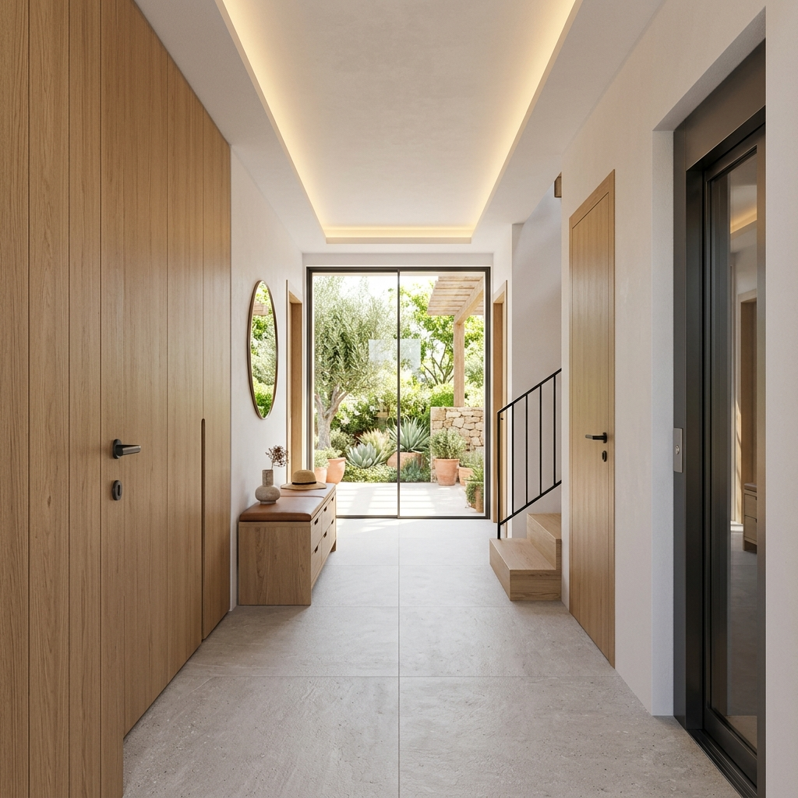

# Simulació visual: Vestíbol d'Accés Casa RSM

Aquesta simulació presenta la proposta estètica per al vestíbol d'entrada, integrant les necessitats d'emmagatzematge definides per al Projecte Executiu.

## Característiques del disseny
- **Material principal:** Fusta de roure clar (Oak) amb veta vertical.
- **Disseny:** Minimalista, sense tiradors visibles (sistema push-to-open o ungler integrat).
- **Funcionalitat:** Armari de gran capacitat a l'esquerra i banqueta de transició amb emmagatzematge inferior.
- **Ambient:** Il·luminació LED càlida encastada al sostre i fosc perimetral.
- **Paviment:** Gres porcelànic tècnic en format gran (60x120 o 90x90) en color gris mineral.

Aquesta imatge serveix de referència per a la discussió amb l'arquitecte sobre els acabats del Projecte Executiu.
