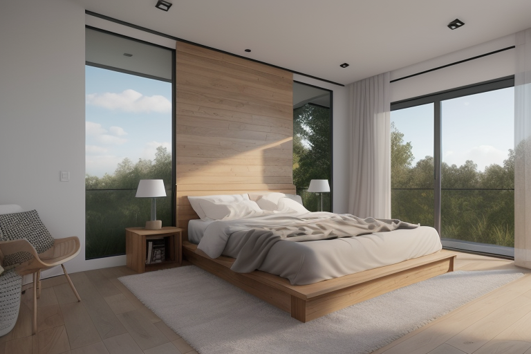
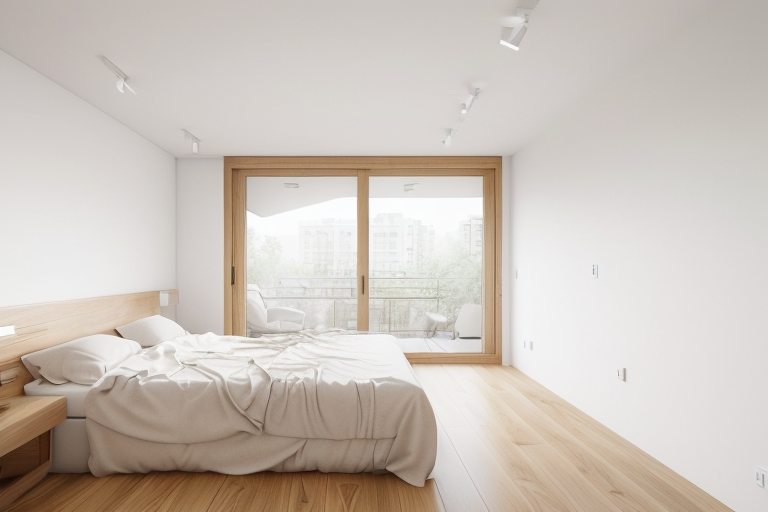
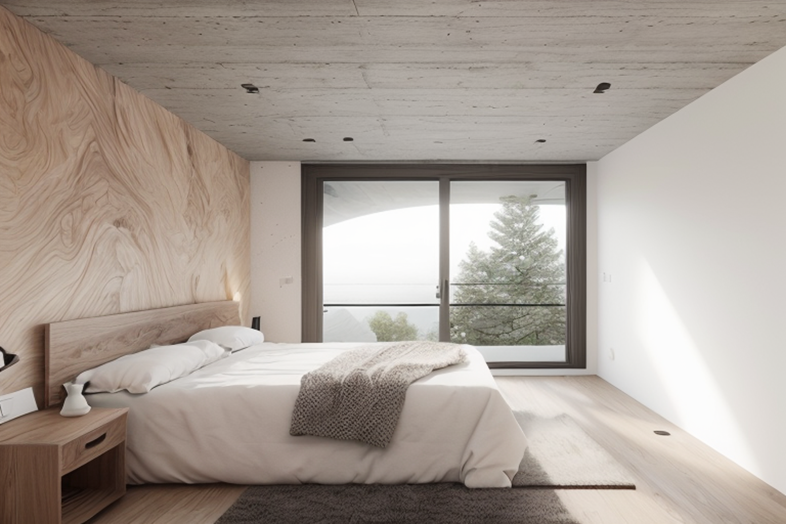
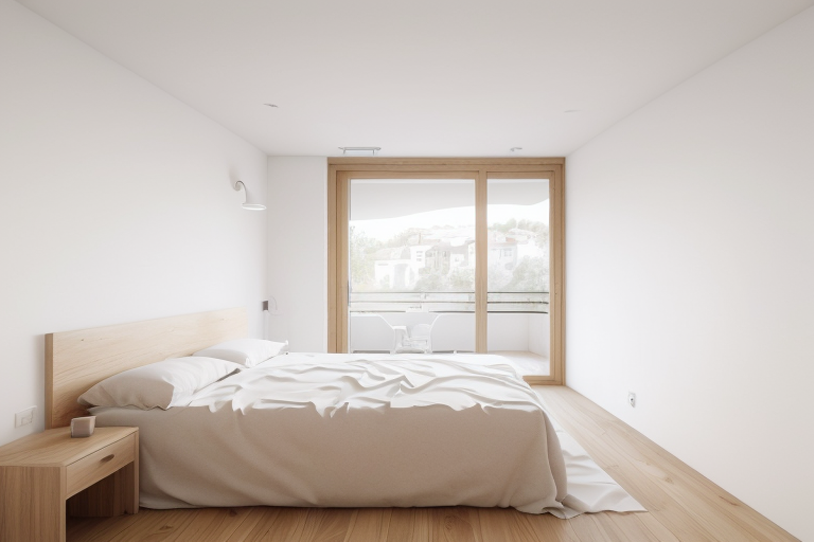

# Metodologia de simulació per al dormitori 2 amb Draw Things

Aquest document defineix l'estratègia tècnica per generar variants controlades de la imatge base del dormitori 2 (`CAllTXFpuyn5NewitjKJK.jpeg`) fent servir l'eina local Draw Things. L'objectiu és poder modificar elements específics (colors, parets, tauletes, portes) sense alterar l'estructura i composició original de l'espai.

## 1. Preparació i models base

Per aconseguir un acabat fotorrealista i arquitectònic professional, el punt de partida és escollir un bon model (Checkpoint) o LoRAs especialitzats.

*   **Models i LoRAs especialitzats en arquitectura/interiorisme (Recomanat):**
    Com a model base s'ha d'utilitzar un Checkpoint arquitectònic específic (com `interiordesignsuperm_v2.safetensors` o `architectureInterior_v70.safetensors`), i és altament recomanable aplicar-hi a sobre **LoRAs especialitzats** com `xsarchitectural-7.safetensors` o `XSarchitectural-38InteriorForBedroom.safetensors`. Aquests arxius s'han d'aplicar a sobre del model (amb un pes recomanat d'entre 0.6 i 0.8) perquè estan "fine-tuned" amb milers de renders d'interiorisme. Gràcies a aquesta combinació (Model Arquitectònic + LoRA Arquitectònic), l'IA entendrà de forma nativa la il·luminació (tipus V-Ray o Corona Render), les proporcions correctes del mobiliari i les textures dels materials de construcció. Dins de Draw Things, l'ús d'aquests LoRAs específics per a dormitoris redueix molt les al·lucinacions estructurals.
*   **Si es treballa amb models genèrics SDXL:** Models com Juggernaut XL, RealVisXL o AlbedoBase XL també entenen bé els materials si no es disposa dels arquitectònics.
*   **Si es treballa amb models genèrics SD 1.5:** Models com Realistic Vision o EpicRealism.

## 2. Mantenir l'estructura global: ControlNet (Multi-ControlNet)

Atès que ja existeix una imatge base on la distribució és la correcta, cal fixar la geometria perquè l'IA només modifiqui els materials i els colors. No s'ha d'utilitzar Text-to-Image pur.

*   **ControlNet Depth (Profunditat):** Carregar la imatge base al ControlNet 1 i seleccionar el model de "Depth" (Zoe Depth o MiDaS). Això indicarà a l'IA on hi ha volums (el llit, l'armari, les parets).
*   **ControlNet Canny o MLSD:** Al ControlNet 2, carregar la mateixa imatge amb "Canny" o "MLSD" (aquest últim és ideal per a línies rectes arquitectòniques com parets i portes). Això fixarà les vores exactes dels mobles i la porta.
*   **Image-to-Image:** Posar la imatge com a referència principal amb un *Denoising Strength* alt (entre 0.65 i 0.85) i un *Prompt* que descrigui exclusivament l'ambient que es busca (ex: "minimalist bedroom, light oak wood floor, sage green walls, white lacquered doors, photorealistic, 8k"). Com que el ControlNet lliga la geometria, es pot apujar el Denoising perquè l'IA tingui llibertat per canviar els materials sense alterar la forma de l'habitació.

### 2.1 Exemple pràctic: Canviar el color i material de les parets i terra (Global)
Si es vol canviar la paleta de colors de tota l'habitació alhora (en comptes de fer-ho element per element):
*   **Acció:** Carregar la imatge sencera (sense màscares).
*   **ControlNet:** Activar ControlNet **Depth** al 100% de pes (Weight: 1.0).
*   **Prompt suggerit:** `sage green walls, raw concrete texture, minimalist bedroom, light oak wood floor, natural lighting`
*   **Denoising Strength:** Entre `0.60` i `0.70` (Prou alt per repintar les superfícies, però el ControlNet s'encarregarà de mantenir cada moble i paret exactament al seu lloc).

## 3. Alteracions estructurals subtils: IP-Adapter (Estils i materials)

Si es vol que la paret o el llit tinguin un estil concret basat en una foto de referència:

*   Activar l'**IP-Adapter** a Draw Things.
*   Carregar-hi la foto del material o de l'habitació que serveix d'inspiració.
*   Això transferirà la paleta de colors i l'estil (com l'estil nòrdic, japandi, etc.) a la geometria controlada pel pas anterior.

## 4. Canvis específics controlats: Inpainting

Si l'objectiu és provar variants d'un sol element (com les tauletes de nit) deixant la resta de l'habitació intacta, s'ha de fer servir l'eina d'Inpainting.

*   Carregar la imatge base a l'eina de "Inpaint" de Draw Things.
*   Dibuixar la màscara (pintar per sobre) únicament de l'element a substituir. És molt important pintar bé per sobre de l'objecte original (incloses les potes de la tauleta vella, per exemple) perquè la IA pugui eliminar-les completament.

### 4.1 Exemple pràctic: Substitució per tauleta flotant
Per canviar la tauleta actual per una tauleta de fusta clara flotant (sense potes) sense alterar res més, s'ha d'utilitzar aquesta configuració exacta:

*   **Prompt Positiu:** `(floating nightstand:1.3), light oak wood, wall-mounted, no legs, modern minimalist design, architectural interior design, photorealistic, 8k resolution, highly detailed wood texture, V-Ray render, natural lighting, <lora:XSarchitectural-38InteriorForBedroom:0.7>`
*   **Prompt Negatiu:** `legs, standing, floor contact, wheels, traditional nightstand, ugly, plastic, low quality, blurry, deformed, watermark, text, dark wood`
*   **Denoising Strength:** Entre `0.75` i `0.85` (per donar llibertat a la IA per eliminar les potes antigues i crear la nova estructura).
*   **ControlNet:** S'ha de **desactivar temporalment** qualsevol ControlNet (com el de "Depth") en aquest pas. Si està activat, forçarà la IA a dibuixar sobre l'estructura de les potes antigues, impedint completament l'efecte flotant.

### 4.2 Exemple pràctic: Canviar el llit i la roba de llit
*   **Mètode:** Inpainting.
*   **Acció:** Pintar la màscara per sobre de tot el llit i la roba actual.
*   **Prompt suggerit:** `white linen bed sheets, fluffy duvet, minimalist pillows, highly detailed fabric, modern bed frame`
*   **Denoising Strength:** Entre `0.70` i `0.85`.
*   **ControlNet:** Desactivat (permet a la IA canviar el volum, les arrugues i la caiguda de la roba de llit lliurement de forma realista).

### 4.3 Exemple pràctic: Canviar les portes
*   **Mètode:** Inpainting.
*   **Acció:** Màscara únicament sobre la porta actual.
*   **Prompt suggerit:** `floor-to-ceiling white lacquered wood door, modern minimalist handle, flush with wall, architectural detail`
*   **Denoising Strength:** Entre `0.75` i `0.85`.
*   **ControlNet:** Desactivat (o, si la porta nova ha de tenir exactament els mateixos marcs, es pot activar un ControlNet de tipus MLSD amb un pes molt baix, per exemple 0.3).

## 5. Ús de LoRAs per afinar detalls

Per aconseguir textures molt concretes i millorar l'acabat final:

*   **LoRAs d'interiorisme:** Aplicar LoRAs específics (com "Japandi Style", "Wabi-Sabi Interior" o "IKEA Catalog") amb un pes baix (0.4 - 0.6) al prompt per canviar radicalment l'atmosfera general de la simulació.
*   **LoRAs de detall:** Els LoRAs tipus "Add Detail" o "More Details" són molt útils per fer que la textura de la roba del llit i de la fusta de la porta assoleixin el màxim realisme.

## 6. Estratègies Avançades: Prompt ADN i Variacions

A partir de la imatge de referència original, s'ha creat un Prompt base ("Prompt ADN") que descriu detalladament tota la composició. Això permet tres línies d'acció diferents depenent de la necessitat de disseny:

### 6.1 Noves distribucions (Text-to-Image pur)
Si l'objectiu és fer *brainstorming* de noves distribucions mantenint els materials de l'habitació original:
*   **Mètode:** Eliminar qualsevol imatge base (Text-to-Image pur).
*   **Resolució:** S'ha d'ajustar la mida a un format fotogràfic estàndard (ex: `768x512`) per evitar que el model SD 1.5 dupliqui mobles (efecte "clonació de llits" en resolucions massa amples).
*   **Resultat esperat:** La IA reinterpreta el prompt i col·loca el llit, el finestral i les parets en una planta completament nova.

### 6.2 Clonació suau (Image-to-Image a baixa força)
Si es vol respectar la geometria exacta i la distribució de la foto original, modificant només petits detalls o repolint les textures:
*   **Mètode:** Image-to-Image de la foto original amb el Prompt ADN.
*   **Configuració:** ControlNet **desactivat** i *Strength (Denoising)* a **0.45**.
*   **Resultat esperat:** S'obté una imatge gairebé indistingible geomètricament de l'original, però processada de nou per millorar detalls i corregir petites imperfeccions texturals de la foto inicial.

### 6.3 Canvis radicals de llum i materials (Image-to-Image fort + ControlNet)
Quan es busca canviar radicalment l'ambientació (ex: de dia a nit "Dark Mode", o de parets blanques a formigó gris fosc) sense que es mogui cap moble:
*   **Mètode:** Image-to-Image de la foto original.
*   **Configuració:** ControlNet `MLSD` o `Canny` actiu al **100% (Weight 1.0)** per fixar la geometria de forma estricta. *Strength* augmentat a **0.80** per donar molta llibertat creativa als nous materials.
*   **Atenció (El problema de la llum base):** A un Strength del 0.80, la IA encara arrossega un 20% de la llum original. Si la foto base és extremadament blanca/il·luminada, la IA no podrà fer el "Dark Mode". La solució és **enfosquir manualment la imatge base** abans de carregar-la a l'aplicació, i posar al prompt negatiu: `bright, sunlight, daylight, white walls, white sheets`.

### 6.4 Modificacions estructurals ("Kitbashing" i Healing per IA)
Quan es necessita alterar les mides de l'habitació (per exemple, acostar una paret per fer l'habitació més estreta), no n'hi ha prou amb el text. S'ha d'utilitzar una tècnica combinada d'edició d'imatge i sanació (healing) per part de la IA:

1.  **El tall manual (Kitbashing):** Amb un programa d'edició (Photoshop, Affinity o Vista Prèvia), es retalla la paret desitjada i es desplaça manualment cap a l'esquerra fins a la nova posició. Aquest procés genera talls bruts, marcs trencats i parquets mal alineats, però serveix de guia geomètrica per a la IA.
2.  **Configuració per al Healing:** Es carrega aquest "muntatge brut" a Draw Things.
    *   **ControlNet:** S'ha d'activar el model `MLSD` al **100% (Weight 1.0)** perquè la IA detecti la nova posició de la paret i les línies rectes i les respecti estrictament.
    *   **Strength (Denoising):** S'ha d'ajustar a **`0.45`**. Això és fonamental: és prou baix perquè no s'inventi parets noves, però prou alt perquè la IA sigui capaç d'esborrar la cicatriu del retall i fusionar les textures de fusta i guix de manera realista.
3.  **Lliçons apreses i resolució d'errors:**
    *   **Marcs desapareguts:** Si en moure la paret manualment es tapa el marc vertical d'una finestra (quedant la paret tocant el vidre), el ControlNet MLSD respectarà aquesta errada i generarà un vidre sense marc. Per solucionar-ho, cal assegurar-se de copiar també un tros de marc de fusta al muntatge de Photoshop perquè la IA sàpiga que allà hi ha un tancament arquitectònic.
    *   **Al·lucinació botànica:** En reduir l'espai i deixar racons buits, els models d'interiorisme tenen tendència a "decorar" afegint plantes que no s'han demanat (efecte típic d'arrossegar el pes de les dades d'entrenament de revistes de decoració). Per frenar aquest impuls, s'ha d'enriquir el Prompt Negatiu amb: `plant, potted plant, vase`.

El resultat d'aquest procés és un render d'un espai de dimensions reduïdes, on la IA ha corregit de forma fotorrealista totes les cicatrius de l'edició manual i ha adaptat el mobiliari a la nova limitació d'espai (per exemple, ometent tauletes de nit si ja no hi caben).

## Resum del flux de treball recomanat

1.  Generar variants d'estil global: Img2Img + ControlNet (Depth + MLSD) per provar combinacions de colors de parets i terres.
2.  Inpainting: Una vegada s'obté una base correcta, utilitzar Inpainting per substituir elements de forma aïllada.
3.  Postprocessat: Fer un pas d'upscale o aplicar un LoRA de detalls per obtenir el render final d'alta qualitat.
